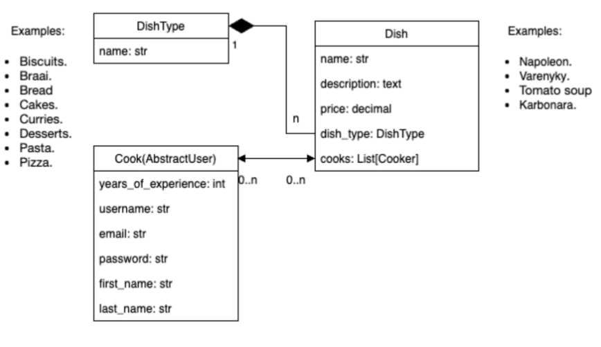
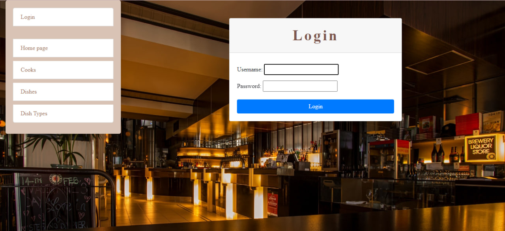
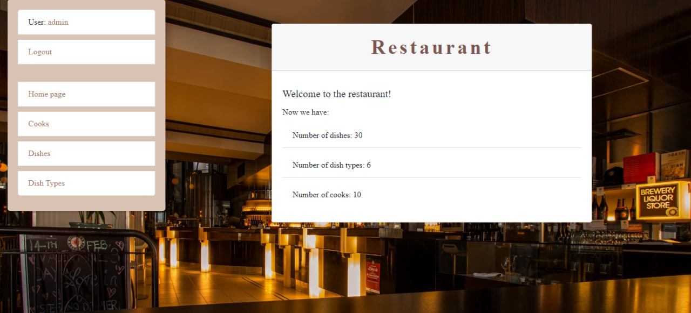
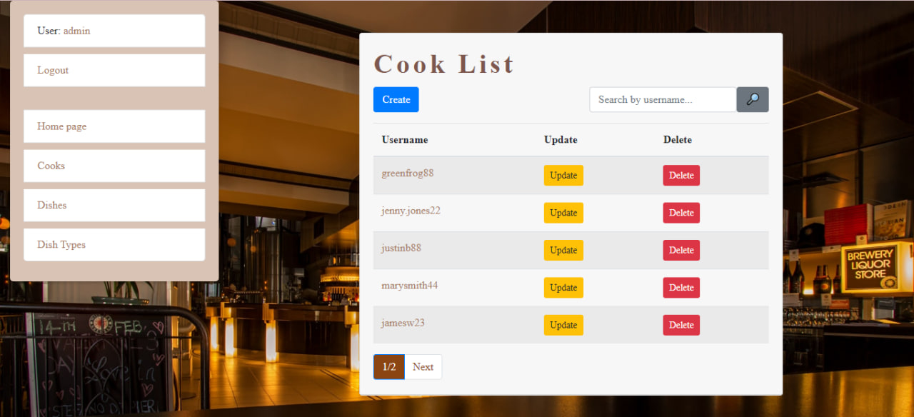

# Restaurant kitchen service

Django project for managing cooks and dishes.

## Check it out!

[Restaurant kitchen service on render.com](https://restaurant-kitchen-service-42f3.onrender.com)

## Credentials
For login you can create your own admin account or use one of the following:

* login: admin
* password: 60D0&4H$Hqka 

## Installation

Python 3 must be already installed.

```shell
git clone https://github.com/myroslavatrschk/restaurant-kitchen-service
cd restaurant-kitchen-service
python -m venv venv
venv\Scripts\activate (on Windows)
source venv/bin/activate (on macOS)
pip install -r requirements.txt
python manage.py migrate
python manage.py runserver
```
## Features

* Authentication functionality for users and cooks
* Managing dishes, dish types & cooks from the website
* Powerful admin panel for advanced management

## Demo








